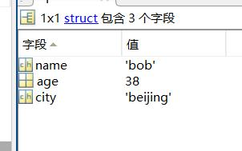

# Matlab_freshman
Matllab新手入门帮助教程
**阅读文档--->基础入门.md**
# Matlab 入门手册
## 1.四种取整类型 
* round ---四舍五入取整，.5时向上取
* fix   ---去掉小数部分
* ceil  ---向上取整
* floor ---向下取整  

```matlab  
%% 取整练习
clear;clc;
a = [3.4 3.6 -2.4 -2.7];
res_round = round(a);
res_fix = fix(a);
res_ceil = ceil(a);
res_floor = floor(a);
disp(['round四舍五入：',num2str(res_round)]);
disp(['fix去除小数部分：',num2str(res_fix)]);
disp(['ceil向上取整：',num2str(res_ceil)]);
disp(['floor向下取整：',num2str(res_floor)]);

```  
运行结果：  

## 2.数值类型  
* 整型
  * 有符号
  * 无符号
* 浮点型
  * 单精度：四个字节，32位，最高位表示符号，8位指数，23位尾数
  * 双精度：八个字节，64位，最高位表示符号，11位指数，52位尾数

可以通过realmin和realmax查看能够表示的最大数和最小数。  matlab默认数值类型为双精度浮点型。
```matlab
realmin('single');realmax('single');
realmin('double');realmax('double');
```   
* 复数

```matlab
%% 复数
clear;clc;
% 构造复数
a1 = complex(2,5);
a2 = 2+5*1i;
if a1 ==  a2
    disp('结果相同');
end
% 求实部虚部
disp(real(a1));
disp(imag(a1));
%模值、幅角
disp(abs(a2));
disp(angle(a2));
% 共轭
disp(conj(a2));
```
  
* 逻辑数值  

这种数值类型占据一个字节。  
```matlab
%% 逻辑数值
clear;clc;
a1 = true(3,4);
a2 = false(3);

a3 = [1 2 3;-7 -8 9;0 2 5];
%数值类型转换为逻辑类型，非0为true1
a4  = logical(a3);
```
  
## 3.数据显示格式
在 MATLAB 中，format 函数用于控制数字和文本的显示格式。它主要影响数字的显示方式，包括小数位数、科学计数法表示等。以下是 format 函数的一些常见用法：

1. format short：默认格式，显示为 4 位小数，或者整数。

2. format long：长格式，显示为 15 位小数，或者整数。

3. format short e 或 format shortE：以科学计数法（小写或大写 "E"）表示，保留 4 位小数。

4. format long e 或 format longE：以科学计数法（小写或大写 "E"）表示，保留 15 位小数。

5. format bank：显示为货币格式，保留 2 位小数。

6. format + 或 format -：正数显示带 "+" 号，或者不显示。

7. format compact：以紧凑形式显示结果，不显示空行。

8. format loose：以松散形式显示结果，显示空行以分隔结果。

9. format rat：以分数形式显示有理数。

10. format hex：以十六进制形式显示数值。  

## 4.函数句柄  
用法：  

* 间接调用函数：自建名 = @函数名(可以是自己写的函数，也可以是现成函数)
* 创建简短的函数表达式 ：自建名 = @（变量1，变量2）含变量的表达式
* 将函数作为参数传入另一个函数 

```matlab
%% 函数句柄
clear;clc;
my_fun = @(x,y)sin(x)+3*cos(y);
disp(my_fun(pi/6,pi/3));

a1 = rand(3,4);
my_fun1 = @(x)x^2;
%arrayfun 将a1数据进行my_fun1函数处理，这里为平方处理
a2 = arrayfun(my_fun1,a1);
disp(a1);
```

## 5.结构体
在 MATLAB 中，结构体（Struct）是一种数据类型，它允许你将不同类型的数据（如数字、字符串、数组等）组合在一起，并使用字段（Fields）来引用和访问这些数据。结构体允许你创建自定义的复合数据类型，使数据的组织和管理更加灵活和可读性强。  
有点像python中的字典类型，第奇数个参数为标签名必须为字符串类型，第偶数个参数为前面那个标签的值。
创建结构体： 可以使用如下语法创建结构体：

matlab
Copy code
myStruct = struct('field1', value1, 'field2', value2, ...);
其中 field1、field2 等是字段名，而 value1、value2 等是对应的值。你可以根据需要添加更多的字段和值。

例如：

person = struct('name', 'John', 'age', 30, 'city', 'New York');
访问结构体字段： 可以使用点操作符 . 来访问结构体的字段。

fieldName = myStruct.fieldName; % 访问结构体字段
例如：

personName = person.name;
修改结构体字段： 通过点操作符也可以修改结构体的字段。

myStruct.fieldName = newValue; % 修改结构体字段的值
例如：

person.age = 31;
结构体数组： 可以将多个结构体存储在一个结构体数组中，每个数组元素都是一个独立的结构体。

people(1) = struct('name', 'Alice', 'age', 25);
people(2) = struct('name', 'Bob', 'age', 28);
结构体作为函数参数和返回值： 结构体可以作为函数的输入参数和返回值，以便传递和返回多个相关的数据。

动态字段添加： 在 MATLAB 中，结构体允许动态地添加新的字段。

myStruct.newField = newValue; % 添加新字段
```matlab
%% 结构体
clear;clc;
%创建结构体
person = struct('name','bob','age',18,'city','beijing');
%访问结构体
disp(person.name);
%修改结构体
person.age = 38;
%结构体矩阵
people(1) = struct('name','a','age',18);
people(2) = struct('name','b','age',28);

```
数据格式很像表格




  
## 6.cell元胞数组[详细内容](https://ww2.mathworks.cn/help/matlab/ref/cell.html)
在 MATLAB 中，Cell（单元格）是一种数据类型，用于存储不同类型的数据，例如数字、字符串、数组等，以及其他单元格。Cell 数组是一种灵活的数据结构，可用于组织和存储各种类型的数据，无需考虑它们的大小或类型。  

**cell 和 struct 是 MATLAB 中两种不同的数据容器类型，它们在存储和组织数据方面有一些区别。** 
以下是 cell 和 struct 的主要区别：

1. 数据存储方式：

Cell 数组（cell）： cell 数组可以存储不同类型、不同大小和不同结构的数据。每个单元格可以包含任何类型的数据，包括数字、字符串、数组、其他 cell 数组等。cell 数组通过索引访问，使用花括号 {}。
结构体（struct）： struct 存储一组相关的数据，每个数据项都是一个字段（field），具有名称和对应的值。每个字段可以存储不同类型的数据。结构体的字段通过点操作符 . 来访问。
2. 索引和访问：

Cell 数组（cell）： 使用花括号 {} 和索引访问 cell 数组中的数据。例如，myCell{1} 将返回第一个单元格中的数据。
结构体（struct）： 使用点操作符 . 和字段名来访问结构体中的数据。例如，myStruct.fieldName 将返回结构体中名为 fieldName 的字段的值。
3. 灵活性：

Cell 数组（cell）： cell 数组适用于存储不同类型和大小的数据，以及构建嵌套的数据结构。由于每个单元格可以存储不同类型的数据，cell 数组更灵活，适合存储不规则的数据。
结构体（struct）： 结构体适用于存储一组相关的数据，并为每个字段提供有意义的名称。它更适合存储具有固定结构的数据。
4. 数据组织：

Cell 数组（cell）： 适用于组织数据集合，但不需要固定的字段名称或顺序。cell 数组的索引可以自由变化。
结构体（struct）： 适用于组织数据，每个字段都有明确的名称。结构体的字段和顺序是固定的。
5. 应用场景：

Cell 数组（cell）： 适用于存储混合类型数据、不规则数据、不同长度的数据以及在数据处理时的临时存储。
结构体（struct）： 适用于表示具有固定属性的数据，如图形对象的属性、数据库记录等。  
```matlab
%% 元胞数组的使用
clear;clc;
% 创建元胞数组-元胞可以为各种数据类型
my_cell = {1,2,3;'text',rand(3,4),{1;2;3}};
% 元胞的索引访问
% 用小括号索引时显示结果为元胞整体的信息，用花括号时为元胞内容
disp(my_cell(2,1));disp(my_cell(2,2));
disp(my_cell{2,1});disp(my_cell{2,2});
% 元胞内容的修改
my_cell{2,1} = 'change_text';
disp(my_cell{2,1});
%cellfun函数功能类似arrayfun
%可视化
figure(1);
cellplot(my_cell,'legend');
```
可视化操作，可以可视化元胞类型：

  
## 7.各种运算符(与C语言基本相同)
* 算数运算符
* 关系运算符：不等于---'~='
* 逻辑运算符：与或非---'&''|''~';  快速与或---'&&''||'(快速的含义为判断为第一个条件成立后就会出结果不在进行第二个条件的判断)
* 逐位逻辑运算：因为比较对象为二进制数，所以通常使用dec2bin将十进制数转换为二进制数。bitand/bitor/bitcmp/bitxor

优先级顺序：不用可以去记，不清楚的时候通过小括号来解决。
## 8.各种年月日时间的操作
(不详细介绍，用到查资料就好)  
## 9.矩阵
1. 矩阵的建立：行内元素用逗号或空格隔开，换行用分号隔开。
2. 矩阵运算：矩阵间的正常运算符合线性代数的规律。两矩阵间元素的运算要保证矩阵形状相同即m*n，加减法直接运算，\*和/要对应改为 .\*和./。
3. 矩阵的关系运算：将矩阵与某个关系比较时是将所有元素与这个关系比较并得到一个逻辑数值类型的矩阵，并且利用这个矩阵可以对原矩阵进行相关操作。  

```matlab
%% 关系运算
clear;clc;
a = [1:3;4:6;5:7];
b = a > 5;
%将a矩阵中大于5的元素改为5
a(b) = 5;
disp(b);
disp(a);
whos
```  
  
4. 矩阵信息的获取：size/length/whos/find/

```matlab
% 矩阵信息
%具体维数
my_size = size(a);
%行数和列数中大的那一个数
my_len = length(a);
%矩阵大小和数值类型
whos("a");
```
  
## 10.对矩阵的操作  
1. 块操作：将某个矩阵作为一个元素重复形成大矩阵
2. 索引的一二维转换
3. 元素删除
4. 转置问题
5. 求和、积、差分
6. 特殊矩阵生成

```matlab
%% 对矩阵的操作
clear;clc;
%产生特殊矩阵:全零、全一、单位、0~1随机、标准正态
a1 = zeros(3);
a2 = zeros(4,5);
disp(a1);disp(a2);
%传入参数类型和用法与a1、a2相同
b1 = ones(3);
b2 = eye(3);
b3 = rand(3);
b4 = randn(3);
for i = 1:4
    disp(eval(['b',num2str(i)]));
end
%元素删除--通过将某个元素修改为空格来删除
b4(2,2) = 0; %删除b4中第二行第二列元素
disp(b4);
b4(3,:) = [];%冒号为取所有的意思，这里是删除第三行所有元素
disp('删除第三行所有元素');
disp(b4);
%转置问题---当矩阵中含有复数时 .' 才是真正转置，普通转置会将复数变为共轭
b3(1,2) = 1-2*1i;
disp('普通转置');
disp(b3');
disp('特殊转置');
disp(b3.');
% 求和、积、差分
b5 = round(10*rand(3,4));
disp(b5);
disp('各列求和');disp(sum(b5));%默认第二个参数为1，1表示对各列求和
disp('各行求和');disp(sum(b5,2));%2表示对各行求和
disp('求和');disp(sum(sum(b5)));%对所有元素求和
disp('各列求积');disp(prod(b5));%用法和sum函数相同
%差分详解
c1 = diff(b5,1,1);%第一个参数为待求矩阵；第二个为差分阶数；...
                  % 第三个为维度默认为1，列间差分
c2 = diff(b5,2,1);
c3 = diff(b5,1,2);%行间差分
for i = 1:3
    disp(eval(['c',num2str(i)]));
end
```  
  


差分结果：  
  
